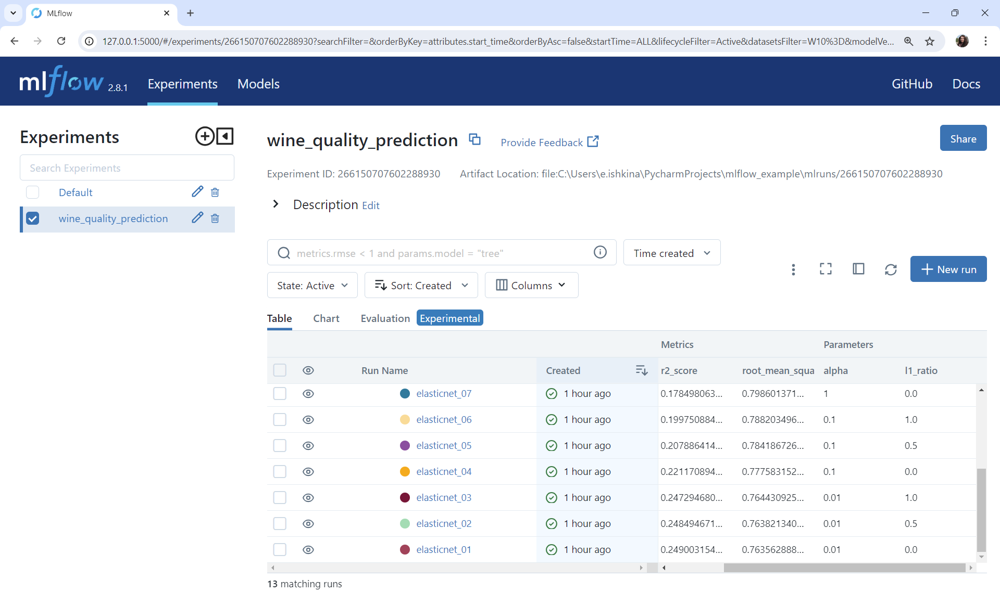

# Example MLflow project

This project demonstrates how to use MLflow to track experiments, register models, and load models from the model registry. The data used in this repo comes from [ics.uci.edu](http://archive.ics.uci.edu/ml/datasets/Wine+Quality)

## Files

- `data/wine_quality.csv`: wine quality dataset
- `config.yml`: configuration file (MLflow backend path, data path, etc.)
- `common.py`: script for getting the processed config constants
- `preprocess_data.py`: script for data preprocessing and saving its results: (X_train, X_test, y_train, y_test)
- `train_elasticnet.py`: script for model training and logging experiments conducted using ElasticNet algorithm 
- `test_model_load.py`: script for loading latest model from mlflow
- `requirements.txt`: package requirements file


## Run Demo Locally

### Preprocess data and save the results to `data/` folder
```shell
$ python preprocess_data.py
```
### Register mlflow runs corresponding to the use of ElasticNet algorithm
```shell
$ python train_elasticnet.py
$ mlflow ui
```
Open http://localhost:5000 to view the mlflow UI.



### Load the latest model from mlflow backend
```shell
$ python test_model_load.py
```

Here are the expected test results:
```shell
      fixed acidity  volatile acidity  citric acid  residual sugar  ...  sulphates    alcohol  target-true  target-pred
4656            6.0              0.29         0.41            10.8  ...       0.59  10.966667            7     6.306061
3659            5.4              0.53         0.16             2.7  ...       0.53  13.200000            8     6.590940
907             7.1              0.25         0.39             2.1  ...       0.43  12.200000            8     6.364277
4352            7.3              0.28         0.35             1.6  ...       0.47  10.700000            5     5.751044
3271            6.5              0.32         0.34             5.7  ...       0.60  12.000000            7     6.415782

[5 rows x 13 columns]
```